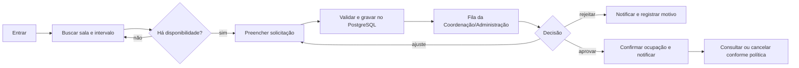

# Squad 3 — Sistema de reserva de salas

**Documento-base para revisão da equipe**  
**Papel de documentação:** Lucas Dórea (ludoc)  
**Estado:** proposta inicial; pontos sem decisão estão marcados como pendências.  
**Stack alvo informada pelo usuário após migração da squad:** React, Java/Spring Boot, PostgreSQL, Spring Security e Docker.

> A migração de stack muda a implementação, não apaga as regras, os fluxos, os testes e as evidências que já foram construídos. Este plano usa o trabalho atual como especificação executável e como fonte de cenários, enquanto trata o novo sistema como dono do seu próprio código e banco.

## 1. Visão geral

O Sistema de Reserva de Salas permite que pessoas autorizadas consultem disponibilidade, solicitem uma sala, acompanhem a decisão e cancelem uma reserva. A Coordenação e a Administração acompanham solicitações e aplicam as regras da instituição.

O produto terá uma interface React, uma API Java/Spring Boot e um banco PostgreSQL. O primeiro incremento será um monólito modular com contratos REST documentados. Essa estrutura mantém o MVP simples e deixa uma fronteira clara para integrar no futuro horários acadêmicos ou outros sistemas.

## 2. Problema

Solicitações de sala dependem de descobrir horários livres, evitar conflitos e comunicar decisões. Sem uma fonte única e regras explícitas, duas solicitações podem disputar o mesmo espaço e a equipe perde visibilidade do estado de cada pedido.

O trabalho existente em Reservas e Alocação já demonstrou fluxos, telas, validações, notificações e cenários de teste. A Squad 3 pode reaproveitar esse conhecimento sem transportar dependências ou modelos de dados incompatíveis para a nova stack.

## 3. Objetivos e medidas de resultado

- Permitir encontrar salas livres por campus, data e intervalo de horário.
- Registrar pedidos com responsável, finalidade, público estimado e recursos necessários.
- Impedir conflitos de sala no banco, mesmo quando dois pedidos chegam simultaneamente.
- Exibir à pessoa solicitante o estado e o histórico da solicitação.
- Dar à Administração uma fila clara de pedidos e ações auditáveis.
- Manter regras de produto independentes da interface e da origem de dados.

**Medidas para a validação do MVP** (metas numéricas a combinar com a Coordenação):

- Toda reserva confirmada tem sala, responsável e intervalo válido.
- Nenhuma reserva ativa sobrepõe outra reserva ativa da mesma sala.
- Cada solicitação tem estado e histórico de decisão consultáveis.
- Uma pessoa sem permissão não consegue aprovar nem editar pedidos de terceiros.

## 4. Escopo

### Incluído no MVP

- Login e autorização por papéis.
- Catálogo de campus, salas e recursos.
- Consulta de disponibilidade por data e intervalo.
- Criação, consulta e cancelamento de solicitação.
- Decisão administrativa de aprovar ou rejeitar, com justificativa quando necessário.
- Histórico de estado e notificações transacionais básicas.
- Interface responsiva e execução local por Docker.
- API REST documentada e testes automatizados de regras críticas.

### Fora do MVP

- Otimização automática de alocação de professores.
- Integração com calendário acadêmico sem fonte oficial e identificadores acordados.
- Sincronização em tempo real entre bancos de sistemas legados.
- Aplicativo móvel nativo, recorrência avançada e cobrança.
- Múltiplas instituições ou configuração completa de tenant.

## 5. Perfis de usuário

| Perfil | Pode fazer |
|---|---|
| Solicitante | Consultar disponibilidade, criar pedidos próprios, acompanhar e cancelar pedidos permitidos pela regra institucional. |
| Coordenação | Acompanhar pedidos da unidade, solicitar ajustes e recomendar/decidir conforme o fluxo aprovado. |
| Administrador | Gerenciar salas e usuários autorizados; aprovar/rejeitar pedidos se essa responsabilidade ficar centralizada. |
| Auditor (opcional) | Consultar dados e histórico sem alterar registros. |

**Decisão necessária:** o fluxo atual de Reservas tem etapas de Coordenação e Reitoria. O MVP da Squad 3 deve manter duas aprovações, usar uma aprovação administrativa ou tornar o número de etapas configurável? Até decisão, o contrato deve registrar ator e decisão sem codificar uma hierarquia rígida.

## 6. Requisitos funcionais

| ID | Requisito | Prioridade |
|---|---|---|
| RF-01 | Autenticar usuários e carregar seus papéis autorizados. Cadastro público nunca pode conceder papel administrativo. | P0 |
| RF-02 | Listar e filtrar salas por campus, capacidade, acessibilidade e recursos. | P0 |
| RF-03 | Consultar disponibilidade para uma data e intervalo, informando reservas e bloqueios que ocupam a sala. | P0 |
| RF-04 | Criar uma solicitação com sala, período, finalidade, quantidade estimada e contato responsável. | P0 |
| RF-05 | Rejeitar pedido inválido ou sobreposto a ocupação ativa da sala. | P0 |
| RF-06 | Consultar pedidos próprios com estado atual e histórico. | P0 |
| RF-07 | Cancelar uma solicitação respeitando estado e prazo definidos pela instituição. | P0 |
| RF-08 | Administrar a fila de pedidos e aprovar, rejeitar ou solicitar ajuste com observação. | P0 |
| RF-09 | Registrar ator, data, estado anterior, estado novo e justificativa de cada decisão. | P0 |
| RF-10 | Enviar confirmação e atualização de estado por e-mail. Falha no provedor não pode perder o registro da reserva. | P1 |
| RF-11 | Exportar a agenda administrativa em formato acordado (CSV/PDF). | P2 |

## 7. Requisitos não funcionais

- **RNF-01 Segurança:** HTTPS em deploy; segredos fora do repositório; validação de autorização no servidor em cada operação protegida.
- **RNF-02 Integridade:** conflitos são prevenidos dentro da transação no PostgreSQL, não apenas na tela.
- **RNF-03 Acessibilidade:** navegação por teclado, foco visível, rótulos associados e contraste legível; adotar WCAG 2.2 AA como referência a validar.
- **RNF-04 Responsividade:** fluxos principais funcionam em desktop e celular.
- **RNF-05 Observabilidade:** logs estruturados com identificador de requisição; nunca registrar senha, token ou conteúdo privado desnecessário.
- **RNF-06 Manutenibilidade:** módulos de domínio separados; DTOs da API não expõem entidades JPA diretamente.
- **RNF-07 Testabilidade:** regras centrais cobertas por teste unitário e de integração com PostgreSQL real em CI.
- **RNF-08 Recuperação:** backups e retenção definidos antes de dados reais entrarem em produção.
- **RNF-09 Desempenho:** a busca de disponibilidade deve responder dentro do SLO que a equipe definir com volume e ambiente representativos.

## 8. Regras de negócio iniciais

1. O intervalo é semiaberto `[início, fim)`: uma reserva que termina às 10h pode ser seguida por outra que começa às 10h.
2. `início < fim`; datas/horários passados são recusados segundo o fuso oficial da instituição (`America/Sao_Paulo`, sujeito à confirmação).
3. Uma sala não pode ter duas ocupações simultâneas em estados que bloqueiam agenda.
4. Estados cancelados e rejeitados não bloqueiam disponibilidade; os estados que bloqueiam precisam ser aprovados pela equipe.
5. Uma solicitação só pode ser alterada/cancelada pelo responsável ou por papel autorizado, respeitando a política de prazo.
6. Aprovar/rejeitar sempre gera histórico imutável com ator, instante e observação.
7. Sala deve atender capacidade e recursos mínimos selecionados no pedido.
8. Indisponibilidade recorrente (aula, manutenção, feriado) é uma ocupação própria, com origem e período; não deve ser simulada como reserva de usuário.
9. A tela nunca é a garantia final de disponibilidade: a API repete validações e o banco arbitra concorrência.
10. Notificação é efeito posterior à gravação. Falha de e-mail gera retentativa/alerta, não rollback da decisão persistida.

**Pendências de negócio:** prazo mínimo/máximo de antecedência; duração mínima/máxima; janela permitida para cancelamento; duração dos períodos; estados exatos; necessidade e ordem das aprovações; política de fins de semana/feriados; campos obrigatórios por tipo de uso.

## 9. Entidades e modelo inicial

```mermaid
erDiagram
  USER ||--o{ RESERVATION : requests
  ROOM ||--o{ RESERVATION : receives
  ROOM ||--o{ ROOM_OCCUPANCY : has
  RESERVATION ||--o{ RESERVATION_HISTORY : changes
  USER ||--o{ RESERVATION_HISTORY : performs
  CAMPUS ||--o{ BUILDING : contains
  BUILDING ||--o{ ROOM : contains
  ROOM ||--o{ ROOM_RESOURCE : supports
  RESOURCE ||--o{ ROOM_RESOURCE : describes

  USER { uuid id PK; string email; string display_name; string role; boolean active }
  CAMPUS { uuid id PK; string code; string name }
  BUILDING { uuid id PK; uuid campus_id FK; string name }
  ROOM { uuid id PK; uuid building_id FK; string code; int capacity; boolean accessible; boolean active }
  RESERVATION { uuid id PK; uuid room_id FK; uuid requester_id FK; timestamp start_at; timestamp end_at; string status; string purpose }
  RESERVATION_HISTORY { uuid id PK; uuid reservation_id FK; uuid actor_id FK; string from_status; string to_status; string note; timestamp created_at }
  ROOM_OCCUPANCY { uuid id PK; uuid room_id FK; timestamp start_at; timestamp end_at; string kind; string source_ref }
  RESOURCE { uuid id PK; string code; string name }
  ROOM_RESOURCE { uuid room_id FK; uuid resource_id FK }
```

`ROOM_OCCUPANCY` representa tanto reservas ativas quanto bloqueios institucionais e deixa a busca independente da origem. A equipe pode materializar essa tabela ou aplicar a exclusão diretamente nas tabelas de ocupação; a integridade contra corrida concorrente precisa continuar no PostgreSQL.

**Índices/consistência sugeridos:** FKs e índices em `room_id`, `start_at`, `end_at`, `status`; intervalos obrigatoriamente válidos; extensão PostgreSQL `btree_gist` e restrição de exclusão com `tstzrange(..., '[)')` para a chave da sala e os estados que bloqueiam agenda. Validar estratégia e migração com o DBA antes de adotar.

## 10. Telas iniciais e direção de UX

1. Login.
2. Início com ações “Consultar salas” e “Minhas solicitações”.
3. Busca de disponibilidade com filtros simples e calendário/linha do tempo.
4. Detalhe de sala (capacidade, localização e recursos).
5. Formulário de solicitação em etapas curtas.
6. Confirmação e acompanhamento do pedido.
7. Fila administrativa com filtros, decisão e histórico.
8. Cadastro administrativo de salas e bloqueios institucionais.

O mockup de horário acadêmico mostra como trazer para um produto só: navegação e fluxo de pedido do Reservas, mais a grade semanal e o azul-marinho característico da Alocação. Ele é referência visual, não evidência de sincronização funcional. A proposta está em [`design/experiencia-integrada.png`](design/experiencia-integrada.png) e no SVG editável adjacente.

Os padrões reutilizáveis extraídos desse mockup (shell de navegação, cabeçalho, filtros, grade, estados, acessibilidade e tokens iniciais) estão em [`design/README.md`](design/README.md) e [`design/tokens.css`](design/tokens.css).

Princípios visuais: identidade UDF discreta, hierarquia clara, poucos campos por etapa, estado sempre visível, cores com significado consistente e grade legível em largura reduzida. Validar com usuários antes de transformar o mockup em tela final.

### Mapa do fluxo principal



## 11. Stack e arquitetura proposta

### Stack alvo

| Camada | Tecnologia |
|---|---|
| Web | React, TypeScript recomendado se a turma aceitar, Vite e cliente HTTP tipado |
| API | Java LTS aprovado pela equipe, Spring Boot, Spring Web, Bean Validation, Spring Data JPA |
| Segurança | Spring Security; provedor de identidade e formato de sessão/token a decidir |
| Persistência | PostgreSQL com Flyway para migrações versionadas |
| Contrato | OpenAPI; contrato versionado junto da API |
| Empacotamento | Docker/Compose no desenvolvimento; CI para build, testes e análise estática |

### Forma da aplicação

Começar com um **monólito modular Spring Boot**, sem microserviços no MVP:

- `identity`: usuários, papéis e autorização.
- `catalog`: campus, prédio, sala e recursos.
- `availability`: consulta de intervalos e bloqueios.
- `reservation`: pedido, cancelamento e ciclo de estados.
- `administration`: fila, decisões e auditoria.
- `notifications`: e-mail assíncrono ou retentável, sem fazer o envio parte da transação principal.

Fluxo: React → API REST Spring → serviço de domínio → repositórios JPA → PostgreSQL. O React nunca acessa o banco. Integrações futuras usam API autenticada/contrato, nunca acesso ao banco do outro sistema.

### Endpoints de partida

```text
GET    /api/v1/rooms?campusId=&capacityAtLeast=&resources=
GET    /api/v1/availability?roomId=&startAt=&endAt=
POST   /api/v1/reservations
GET    /api/v1/reservations/mine?page=&size=
GET    /api/v1/reservations/{id}
POST   /api/v1/reservations/{id}/cancel
GET    /api/v1/admin/reservations?status=&from=&to=
POST   /api/v1/admin/reservations/{id}/decision
GET/POST/PATCH /api/v1/admin/rooms
```

Respostas usam DTOs; erros têm `code`, `message`, `requestId` e, quando seguro, campos inválidos. Operações repetíveis (criação/decisão) devem definir política de idempotência.

## 12. Como reaproveitar o trabalho atual

| Ativo existente | Reuso na Squad 3 | Tratamento na migração |
|---|---|---|
| Fluxo de solicitação → Coordenação → Reitoria | Requisitos, estados possíveis, textos e cenários de ponta a ponta. | Confirmar se as duas aprovações continuam; então reimplementar no domínio Java. |
| Validação de datas/períodos passados | Regra e testes de regressão já identificaram um erro real de agenda. | Portar a regra com `Clock` injetável e timezone explícito; testar limites de horário. |
| Bloqueio de salas por aulas | Regra de disponibilidade e casos de conflito. | Modelar como ocupação institucional. Só importar dados com calendário oficial e chaves comuns. |
| Alocação: grade por curso/semestre | UX de coordenação e contrato GET/PUT como protótipo. | Reimplementar contrato no Spring ou consumir API autorizada; não copiar acesso ao banco Flask. |
| Componentes/estilo React e mockup integrado | Referência de navegação, hierarquia, cores e composição. | Reaproveitar seletivamente; ajustar ao React da nova stack e às diretrizes da equipe. |
| Testes automatizados/E2E do Reservas | Casos de aceite para reserva, conflito, revisão, aprovação e cancelamento. | Converter cada comportamento em testes Spring/React no novo repositório. |
| Evidência de build, testes e operação local | Base para CI, checklist de review e demonstração. | Gerar evidência novamente no repositório/stack alvo; evidência legada não prova novo build. |
| Modelos Mongo/SQL existentes | Dicionário de campos e descoberta de dados legados. | Não transportar IDs como se fossem universais; desenhar migração explícita e reconciliável. |

### O que não deve ser transplantado sem adaptação

- Repositórios/DAL Flask, dependências Python, configuração MongoEngine ou acesso direto a bancos legados.
- Autorização baseada apenas em controles da interface.
- Identificadores de curso/disciplina incompatíveis: Reservas usa `COD_DISC` em ofertas; Alocação usa `Disciplina.id` local.
- Horários sintéticos ou o protótipo local como se fossem calendário oficial.
- A consulta antiga de disponibilidade como garantia de não concorrência; a reserva final exige trava/constraint transacional no banco.

### Fronteira de migração

1. Preservar especificação, linguagem de domínio, telas de referência e testes; congelar contratos antes da implementação Java.
2. Implementar o novo MVP com PostgreSQL próprio e dados sintéticos no ambiente de desenvolvimento.
3. Comparar os novos resultados com cenários de referência do Reservas/Alocação.
4. Migrar dados reais apenas depois de inventário, mapeamento de IDs, deduplicação, aprovação da UDF e ensaio de reconciliação.
5. Integrar horários por API autenticada e versionada, se a fonte oficial e os identificadores forem confirmados.
6. Só desativar ou substituir componente antigo após validação operacional e aceite dos responsáveis.

## 13. Cronograma inicial por incrementos

Estimativa relativa, não prazo comprometido. Ajustar a duração conforme tamanho e calendário da squad.

| Incremento | Resultado demonstrável | Saída |
|---|---|---|
| 0 — Alinhamento | Escopo, fluxo de aprovação, papéis, fonte de salas/calendário e stack confirmados. | Decisões e mapa do fluxo aprovados. |
| 1 — Fundação | React, Spring Boot, PostgreSQL, Docker, migrações, CI e autenticação mínima. | Login protegido e health check; pipelines verdes. |
| 2 — Catálogo e disponibilidade | Salas persistidas e consulta por período. | Busca responsiva, teste de intervalos e dados de demonstração. |
| 3 — Solicitação e cancelamento | Criar, acompanhar e cancelar conforme política. | Fluxo do solicitante com histórico. |
| 4 — Administração | Fila e decisões auditáveis; notificações retentáveis. | Coordenação/admin conclui ciclo do pedido. |
| 5 — Integração e adoção | Comparação com legado, migração ensaiada e documentação operacional. | Plano de corte reversível e aceite. |

## 14. Riscos e dependências

| Risco/dependência | Efeito | Mitigação/ação |
|---|---|---|
| Regras de aprovação ainda não confirmadas | Retrabalho no ciclo de estados e permissões. | Fechar decisão no incremento 0; manter ator/decisão extensível até lá. |
| Sem catálogo oficial de salas e responsáveis | Busca/demonstração não representa operação real. | Nomear fonte e responsável; usar seed claramente sintético até então. |
| Chaves de curso/disciplina divergentes | Horários podem bloquear sala errada. | Criar crosswalk explícito validado; nunca inferir por nome apenas. |
| Concorrência de reservas simultâneas | Dupla ocupação mesmo após checagem na tela. | Constraint de exclusão ou estratégia transacional equivalente no PostgreSQL; teste concorrente. |
| Migração dos sistemas existentes | Duplicidade/perda de histórico. | Export imutável, mapping table, contagens, reconciliação e rollback ensaiados. |
| Provedor de identidade/e-mail não escolhido | Login e avisos ficam inconsistentes. | Decidir integração e ambiente de teste antes do incremento 1. |
| Capacidade de hospedagem/CI não definida | Atraso entre desenvolvimento e uso. | Definir conta, responsáveis, ambientes, segredos e política de deploy. |
| Escopo crescer para resolver alocação automática | Atraso do fluxo central de reservas. | Manter otimização de horários fora do MVP; integrar grade só por contrato claro. |

## 15. Organização da squad

As responsabilidades abaixo são papéis de trabalho; a equipe deve atribuir pessoas e combinar substituições. Papel técnico do sistema (por exemplo, `ADMIN`) é diferente do papel organizacional da squad.

| Atividade | Responsável (R) | Aprovador (A) | Consultados (C) |
|---|---|---|---|
| Requisitos e critérios de aceite | Documentador + responsável da história | Product owner/Coordenação | Devs e usuários representantes |
| Regras de reserva e aprovações | Documentador facilita registro | Coordenação responsável pelo processo | Solicitantes e devs |
| Arquitetura e contratos REST | Tech lead/backend | Tech lead ou responsável técnico | Frontend, QA, DBA/infra |
| UX, protótipo e acessibilidade | Frontend/UX | Product owner | Solicitantes, Coordenação, documentador |
| Esquema, migração e integridade | Backend/DBA | Responsável técnico | QA e dono dos dados |
| Testes de aceitação e evidências | QA + pessoa autora da história | Product owner aceita comportamento | Devs e documentador |
| Deploy, segredos, backup e suporte | DevOps/maintainer designado | Dono do ambiente | Tech lead e Coordenação |
| Rastreabilidade e documentação | Lucas Dórea (documentador) | Product owner/Coordenação | Toda a squad |

Ritmo sugerido: revisar backlog e bloqueios no início de cada ciclo; demonstrar um fluxo utilizável ao fim; registrar decisões e mudanças de escopo no mesmo local do documento. A equipe define a duração do ciclo conforme o calendário do curso.

## 16. Critérios de pronto

Uma história está pronta quando:

- critérios de aceite passam em testes automatizados relevantes;
- autorização é verificada na API e há teste para acesso negado;
- migração Flyway sobe em banco vazio e em banco da versão anterior suportada;
- UI tem estados de carregamento, vazio, sucesso e erro; usa teclado e layout responsivo;
- logs têm request ID e não expõem segredos/dados desnecessários;
- OpenAPI e README foram atualizados;
- CI verifica build, testes, análise estática e imagem Docker;
- a demonstração usa dados identificados como sintéticos;
- mudança de schema ou configuração traz instruções explícitas de deploy/rollback;
- revisores e responsável de produto aceitam os critérios da história.

## 17. Próximos passos

1. Confirmar o fluxo de aprovação (Coordenação + Reitoria ou uma única Administração).
2. Definir quem administra o catálogo de salas, os papéis e o calendário.
3. Confirmar Java LTS, autenticação, hospedagem e repositório alvo.
4. Validar requisitos e o mockup com pelo menos uma pessoa solicitante e uma da Coordenação.
5. Aprovar o modelo de ocupação/conflito antes de implementar a primeira reserva.
6. Abrir backlog em uma única fonte e vincular cada cartão ao requisito, teste e entrega.
7. Implementar um vertical slice: catálogo → disponibilidade → pedido → conflito → decisão.
8. Atualizar este documento com decisões reais; remover “pendente” somente após validação da equipe.

## 18. Documentos iniciais e links de referência

Este pacote contém visão, escopo, requisitos, regras, modelo, arquitetura, mapa de reuso, plano, riscos e critérios. Os complementos são:

- [`02-backlog-inicial.md`](02-backlog-inicial.md): histórias iniciais, dependências e aceite.
- [`03-checklist-de-inicio.md`](03-checklist-de-inicio.md): checklist de preparação da squad.
- [`projeto.json`](projeto.json): resumo estruturado para automação/transferência.
- [`design/experiencia-integrada.svg`](design/experiencia-integrada.svg): mockup vetorial editável.

Referências oficiais: [React](https://react.dev/learn), [Java](https://dev.java/learn/), [Spring Boot](https://spring.io/projects/spring-boot), [Spring Security](https://docs.spring.io/spring-security/reference/), [PostgreSQL](https://www.postgresql.org/docs/), [Docker](https://docs.docker.com/get-started/), [GitHub](https://docs.github.com/), [Markdown](https://www.markdownguide.org/basic-syntax/), [Figma](https://help.figma.com/hc/en-us/categories/360002042553-Design), [Kanban](https://www.atlassian.com/agile/kanban).

---

**Nota de rastreabilidade:** os problemas e oportunidades usados para desenhar este plano vieram de uma revisão dos projetos legados e de protótipos locais. Eles não confirmam dados ou disponibilidade de qualquer ambiente de produção. O inventário de reuso precisa ser validado pela Squad 3 antes de decisões de migração de dados. Este repositório não inclui código legado nem depende de caminhos da máquina que preparou a proposta.
