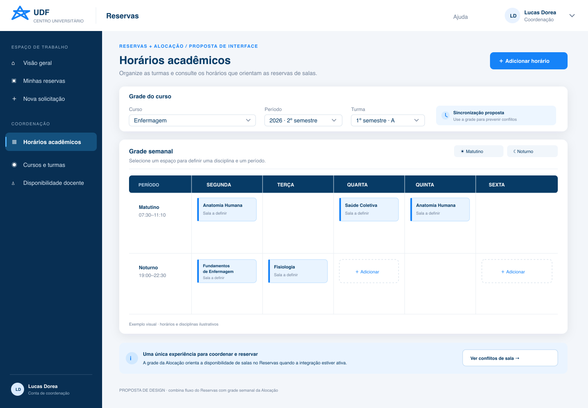

# Design pattern — Reservas UDF

Esta referência extrai padrões do mockup [`experiencia-integrada.png`](experiencia-integrada.png). É um **ponto de partida visual**, não uma identidade aprovada nem uma cópia pixel a pixel. A squad deve validar os padrões com pessoas solicitantes e Coordenação antes de consolidar o design system.

## Ideia central

Uma aplicação única combina a navegação direta do fluxo de Reservas com a visualização densa e estruturada da grade da Alocação. Elementos compartilhados — cabeçalho, navegação, botões, estados e tipografia — mantêm a coerência; conteúdo de cada área continua organizado por tarefa.

## Padrões extraídos

### 1. Shell de aplicação

- Barra superior branca com marca UDF, nome do produto, ajuda e menu da conta.
- Navegação lateral azul-marinho agrupada por tarefa e por papel. Item atual recebe fundo mais claro, indicador lateral e rótulo acessível.
- Em telas estreitas, trocar a barra lateral por menu recolhível; manter título e ação principal visíveis.
- Não esconder a identidade da pessoa usuária nem misturar papel organizacional da squad com papel de autorização do produto.

### 2. Cabeçalho da página

- Eyebrow curto indica módulo ou contexto; título nomeia a tarefa; frase auxiliar explica a ação.
- Ação primária fica à direita em desktop e em posição previsível após o título em mobile.
- Usar um único botão primário por região. Ações secundárias ficam outline ou em menu contextual.

### 3. Painel de filtros

- Agrupar curso, período e turma no mesmo cartão quando filtram a mesma grade.
- Rotular cada campo acima do controle; não depender de placeholder como rótulo.
- Estado de sincronização fica separado dos filtros e usa texto + ícone, nunca apenas cor.
- Em mobile, empilhar os campos e permitir limpar/confirmar sem deslocar o contexto.

### 4. Grade semanal

- Dias no cabeçalho; períodos como linhas; ocupações como cartões dentro de células.
- Cabeçalho escuro fornece contraste e orientação; cartões claros diferenciam conteúdo sem transformar a tela numa parede de cores.
- Cada cartão mostra disciplina/uso e metadado útil (ex.: sala, docente ou status), com texto quebrável em títulos longos.
- Célula vazia pode oferecer ação contextual “Adicionar”, com alvo de toque adequado.
- Em telas estreitas, permitir rolagem horizontal com indicação visual ou oferecer visualização diária/lista; preservar rótulos de dia/período em todo momento.
- A grade mostra estado conhecido, mas não garante disponibilidade: conflito final é validado pela API e pelo banco.

### 5. Aviso de integração

- Usar uma faixa informativa no rodapé do conteúdo para explicar uma integração ou regra transversal.
- O texto deve distinguir claramente “ativo”, “pendente” e “proposta”. O mockup sinaliza sincronização futura; não afirmar que ela já existe.

### 6. Estados de interface

O mockup cobre apenas o estado preenchido. Cada padrão precisa também de:

- **Carregando:** preservar estrutura e usar indicador com rótulo, sem pular o layout.
- **Vazio:** explicar por que a lista/grade está vazia e oferecer ação útil.
- **Erro:** mensagem clara, contexto preservado e tentativa de recuperação.
- **Conflito:** explicar sala/intervalo conflitante e oferecer novas opções; não apagar o formulário.
- **Sucesso:** confirmar a ação e indicar o próximo passo.
- **Sem permissão:** ocultar ações indevidas e, na API, sempre negar a operação protegida.

## Tokens iniciais

Valores extraídos do SVG do mockup; espaçamentos, raios e tipografia são aproximações de design e podem ser ajustados após validação.

| Papel | Token CSS | Valor inicial |
|---|---|---|
| Primária de ação | `--color-action` | `#1683F8` |
| Navegação escura | `--color-navy` | `#082F53` |
| Cabeçalho/ênfase | `--color-navy-strong` | `#073B66` |
| Fundo de página | `--color-page` | `#F3F6FA` |
| Superfície | `--color-surface` | `#FFFFFF` |
| Texto secundário | `--color-muted` | `#718198` |
| Borda | `--color-border` | `#E7EDF3` |
| Destaque suave | `--color-accent-soft` | `#EAF4FF` |
| Espaçamento | `--space-*` | escala 4 / 8 / 12 / 16 / 24 / 32 px |
| Cantos | `--radius-*` | 6 / 9 / 13 px |
| Tipografia | `--font-sans` | Inter, com fallback system-ui |

Os tokens estão em [`tokens.css`](tokens.css), prontos para serem consumidos pela aplicação. Cor de estado (erro, sucesso, alerta) deve ser definida com texto, ícone e contraste validados; não foi inferida do mockup.

## Acessibilidade e comportamento

- Garantir contraste WCAG 2.2 AA e foco de teclado claramente visível antes do merge do design system.
- Botões/células acionáveis devem ter nome acessível e alvo de toque confortável; não usar apenas ícones sem rótulo acessível.
- A seleção do menu informa o estado com `aria-current`; foco não depende de cor.
- Na grade, definir semântica de tabela/grid e navegação por teclado antes de tornar células editáveis.
- Respeitar zoom/reflow: não exigir a leitura de texto em tamanho fixo nem esconder ações ao ampliar.

## Uso e manutenção

1. Trate `experiencia-integrada.svg` como fonte vetorial editável e PNG como preview.
2. Implemente componentes React pequenos por padrão (`AppShell`, `PageHeader`, `FilterPanel`, `WeeklySchedule`, `StatusBanner`).
3. Mantenha os componentes sem regra de negócio; a API é fonte de verdade de disponibilidade e permissões.
4. Quando um padrão mudar, atualizar tokens, imagem, descrição e teste visual/acessível juntos.
5. Documentar decisões aprovadas em ADR; até lá, chamar os valores de “tokens iniciais”.
